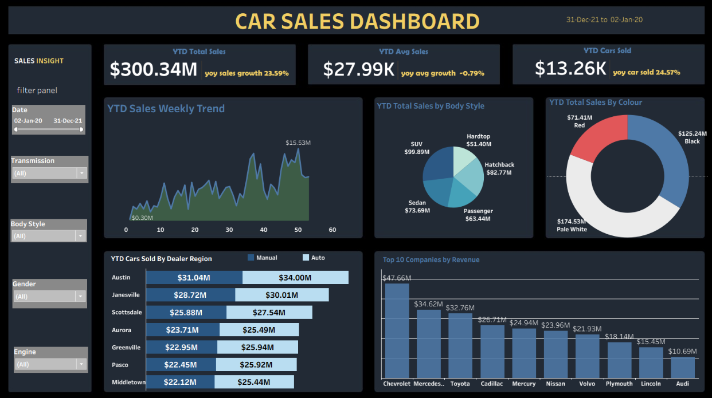

# 🚗 Car Sales Dashboard | Tableau

## 📊 Project Overview

This project is an interactive **Car Sales Dashboard** created using **Tableau**. The dashboard provides a comprehensive view of car sales performance, trends, regional sales, vehicle characteristics, and top-performing companies.

The goal of this project is to transform raw car sales data into meaningful visual insights that can support business analysis and decision-making.

## 🛠️ Tools & Technologies

* **Tableau** – Dashboard creation and data visualization
* **Microsoft Excel** – Data source
* **Data Analysis**
* **Data Visualization**

## 📈 Dashboard Features

The dashboard includes the following visualizations:

* **YTD Total Sales**
* **YTD Average Sales**
* **YTD Cars Sold**
* **YTD Sales Weekly Trend**
* **YTD Total Sales by Body Style**
* **YTD Total Sales by Colour**
* **YTD Cars Sold by Dealer Region**
* **Top 10 Companies by Revenue**

## 🎯 Key Performance Indicators

| KPI                      |    Value |
| ------------------------ | -------: |
| YTD Total Sales          | $300.34M |
| YTD Average Sales        |  $27.99K |
| YTD Cars Sold            |   13.26K |
| YOY Sales Growth         |   23.59% |
| YOY Average Sales Growth |   -0.79% |
| YOY Cars Sold Growth     |   24.57% |

## 🔎 Interactive Filters

Users can interact with the dashboard using filters such as:

* Date
* Transmission
* Body Style
* Gender
* Engine

These filters allow users to explore sales performance based on different vehicle and customer attributes.

## 📸 Dashboard Preview



## 📂 Project Files

```text
tableau-sales-dashboard/
│
├── Car Sales Data.xlsx
├── README.md
├── car_sales_project.twbx
└── dashboard.png
```

### File Description

* **Car Sales Data.xlsx** – Dataset used for the analysis
* **car_sales_project.twbx** – Tableau packaged workbook
* **dashboard.png** – Dashboard preview image
* **README.md** – Project documentation

## 💡 Key Insights

The dashboard helps analyze:

* Overall car sales performance and year-over-year growth.
* Weekly sales trends.
* Sales distribution across different body styles.
* Sales distribution by car colour.
* Dealer region performance.
* Manual vs. automatic transmission sales.
* Top companies based on revenue.

## 🚀 Future Enhancements

* Add sales forecasting.
* Add profit and cost analysis.
* Add customer segmentation.
* Add geographic sales analysis.
* Add detailed brand and model analysis.
* Publish the dashboard on Tableau Public.

## 👩‍💻 Author

**Anitha G **

**Project:** Car Sales Dashboard
**Domain:** Data Analytics & Data Visualization
**Tool:** Tableau
